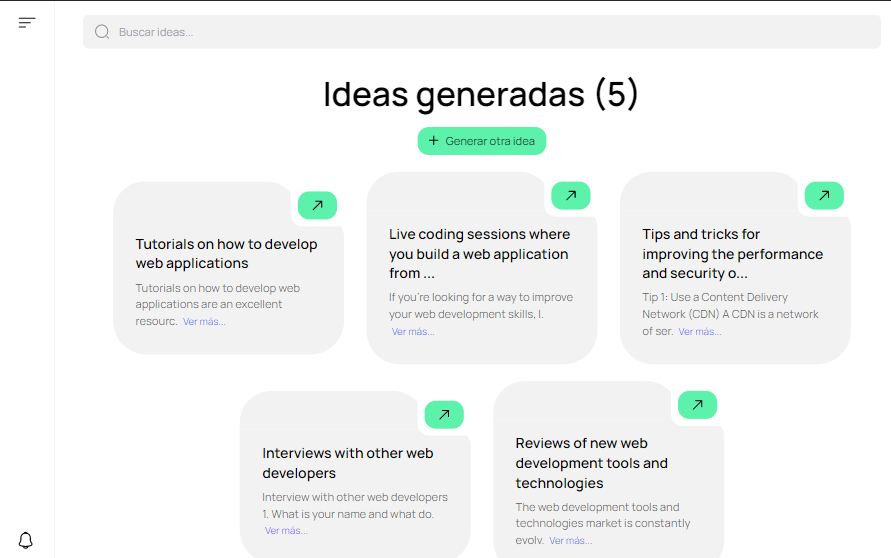
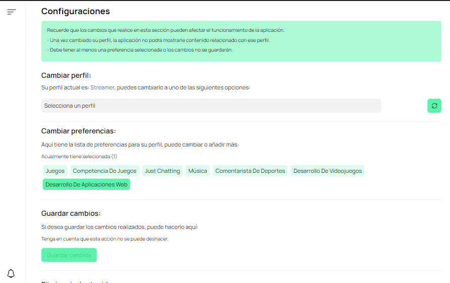
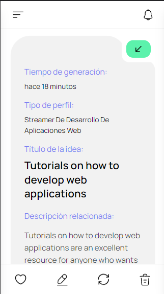

# Cohere-hackathon - Generate Ideas from AI (LLuvIA de ideas)

LluvIA de ideas es Aplicación web que permite al usuario generar ideas para crear contenido, estas ideas se generan gracias a la API de 
[co:here](https://cohere.ai) que mediante inteligencia artificial interpreta el promtp personalizado con una pregunta especial, mientras la respuesta se muestra en la interfaz, estas respuestas o ideas pueden ser eliminadas, re-generadas, editas(En desarrollo) o selecionadas como favoritas(En desarrollo) 

Esta es una solución para la hackaton de [@midudev](https://www.twitch.tv/midudev) + [co:here](https://cohere.ai). 

## Table of contents

  - [The challenge](#the-challenge)
  - [Screenshot](#screenshot)
- [My process](#my-process)
  - [Built with](#built-with)
- [Author](#author)

### The challenge

Los usuarios deben ser capaces de:

- Ver el diseño óptimo según el tamaño de pantalla de su dispositivo
- Ver la lista de ideas generadas
- Crear ideas.
- Buscar o filtrar ideas.
- Regenerar ideas.
- Elimnar ideas.
- Cambiar de perfil y preferencias.

### Screenshot

## My process

### Built with

- Semantic HTML5 markup
- CSS custom properties
- Vite
- ReactJS
- Mobile-first workflow
- Co:here API
- TranslatorText API
- DateFns
- Uuid

## Author

- Linkedin - [Juan Mosquera](https://www.linkedin.com/in/juanmosquera98/)
- Frontend Mentor - [@yosoyteamc](https://www.frontendmentor.io/profile/Yosoyteamc)
- Instagram - [@yosoyteamc](https://www.instagram.com/yosoyteamc/)

